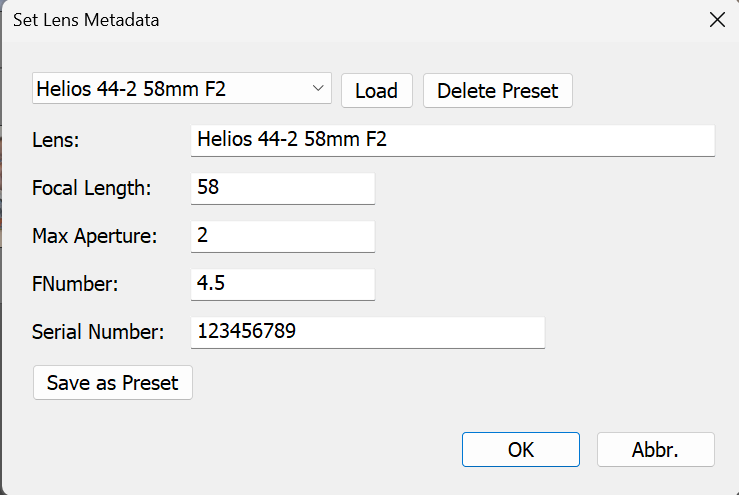

# Set Lens Metadata Plugin for Lightroom

This Lightroom Classic plugin allows you to set lens metadata (e.g. lens name, focal length, aperture) on XMP sidecar files – especially useful for images taken with vintage or manual lenses that lack proper EXIF data.

## ⚠ Disclaimer

Use at your own risk.  
I'm not a professional developer, just a photographer who needed a tool like this and couldn't find one – so I built it myself. Feel free to contribute or suggest improvements!

---

## ✨ Features

- Add or update lens metadata via ExifTool
- Supports presets for commonly used manual lenses
- Designed for use with XMP sidecar files (RAW images)

---

## 📦 Installation

1. **Download or clone this repository** into your Lightroom plugins folder.
2. **Download [ExifTool](https://exiftool.org/)** (required):
   - Windows users: Place `exiftool(-k).exe` in `resources/exiftool.exe` within the plugin directory.
   - macOS/Linux users: Install via package manager or manually, and modify `ExifToolCommand.lua` to use the correct path.
3. **Enable the plugin**:
   - In Lightroom, go to `File > Plug-in Manager`
   - Click `Add` and select the plugin folder
   - Enable it

---

## 🛠️ Usage Instructions

### 1. Save Metadata to XMP
Before using the plugin, make sure metadata is saved to XMP sidecar files:
- Select your RAW images
- Press `Ctrl+S` (or `Cmd+S` on Mac) in Lightroom

### 2. Use the Plugin
- Select one or more photos in the Library module
- Go to `Library > Plug-in Extras > Set Lens...`
- Fill in the desired lens data (Lens name, focal length, aperture, etc.)
- Save a preset if needed
- Click OK

The plugin uses ExifTool to update the XMP files.

### 3. Reload Metadata
After running the plugin:
- Select the modified photos again
- Choose `Metadata > Read Metadata from Files` in Lightroom

---

## 🧰 Technical Notes

- Plugin writes to the `.xmp` files using ExifTool
- Existing metadata is overwritten in-place
- A warning will appear if any XMP file is missing

---

## 📄 License

This project is licensed under the MIT License.  
ExifTool is a separate tool with its own license – see [exiftool.org](https://exiftool.org/) for details.

